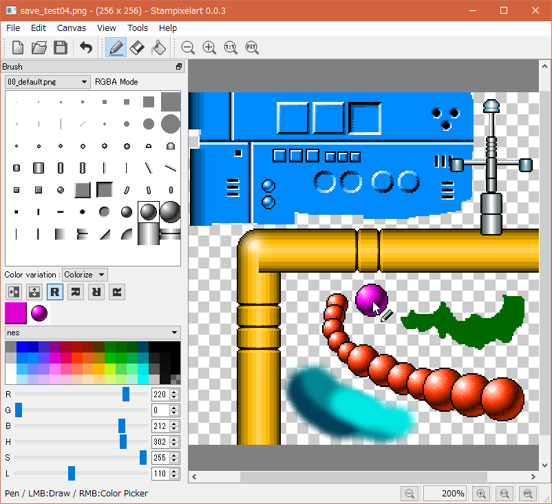

Stampixelart
============

Pixel art creation tool.

Description
-----------

ドット絵用のパーツを、スタンプのように貼り付けていくことで、ドット絵作成を少しは楽にできないだろうかと試しに作ってみたCGツールです。

Python 2.7 + PySide + Pillow(PIL) を使って作りました。

Screenshot
----------

Demo
----

Under Construction.

Requirement
-----------

動作には以下が必要です。

* Python 2.7
* PySide
* Pillow (PIL)

動作確認環境: Windows10 x64 + Python 2.7.12 + PySide 1.2.4 + Pillow 3.4.2

Usage
-----

以下を打ち込めば実行できます。

    python stampixelart.py

### 操作方法

* マウス左ボタン : 選択ブラシでスタンプ。
* マウス右ボタン : カラースポイトツール。
* マウス中ボタンドラッグ : キャンバスをスクロール。
* マウスホイール回転 : キャンバスの拡大縮小。

- - - -

* Mouse Left button : Stamp.
* Mouse Right button : Color picker.
* Mouse Middle button Drag : Canvas scroll.
* Mouse Wheel : zoom.

### ブラシの追加方法

brushesフォルダにpng画像を追加すればブラシを増やせます。以下を満たしていればブラシ画像として利用できます。

- png画像であること。
- グレースケール、もしくは、RGBAフルカラー画像であること。
- 1枚、256x256ドットであること。
- 1つのブラシは32x32ドットで、8x8個並んだ状態になっていること。

Install
-------

動作に必要なものについて、インストール方法(Windows版)をメモしておきます。

### Python

[Welcome to Python.org](https://www.python.org/)

### PySide

[PySide 1.2.4 : Python Package Index](https://pypi.python.org/pypi/PySide/)

    pip install -U PySide

### Pillow

[Pillow 3.4.2 : Python Package Index](https://pypi.python.org/pypi/Pillow/3.4.2)

[Python Extension Packages for Windows - Christoph Gohlke](http://www.lfd.uci.edu/~gohlke/pythonlibs/#pillow)

Pillow-3.4.2-cp27-cp27m-win32.whl を入手後、以下を実行。

     pip install Pillow-3.4.2-cp27-cp27m-win32.whl

Licence
-------

CC0 / Public Domain.

pyファイルと添付画像ファイルは CC0 / Public Domain ってことでよろしくです。

(PySideのバイナリはライセンスが LGPL なので、もし、このファイルをexeファイル等に変換して配布する際には、このあたり変わってくるのかもしれないけど現状そのへんよく分かってないです。)

Author
------

[mieki256](https://github.com/mieki256)

補足
----

### 作った動機

一般的なお絵かきソフト(GIMP等)は、ブラシ画像として、以下の2種類を使えますが…。

- 指定色を反映できるグレースケール画像のブラシ
- 指定色を無視するRGBA画像のブラシ(アルファチャンネルを持ったフルカラー画像のブラシ)

もし、後者のRGBA画像ブラシで、指定色を反映させながらキャンバスに描画できたら何か使い道があるのだろうかと疑問が湧いたので、こうして実験用サンプルを書いてみたのでした。さて、これで何か見えてくるのだろうか…。どうなんだ…。

ちなみに、誰かが作ったパーツ画像をペタペタ貼ってドット絵を作るだけなら、既存のドットエディタ(EDGE等)で、選択 → コピー → 貼り付けを繰り返すことで済むと思います。
